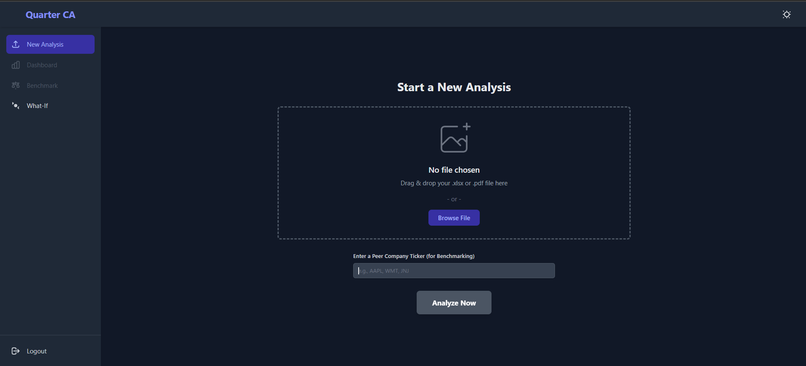
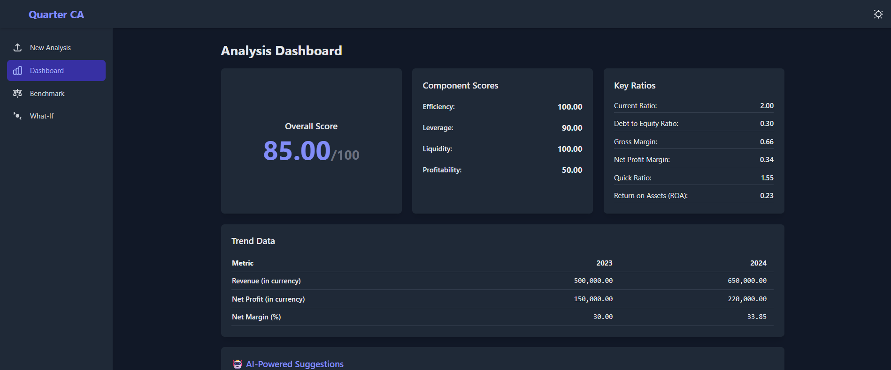

# 📊 Quarter CA — SME Financial Intelligence Platform

Quarter CA is an **AI-powered financial analysis platform** designed to help small and medium enterprises (SMEs) understand their financial health, make informed decisions, and simulate business scenarios — without requiring deep accounting expertise.

Built by **Team Quarter CA** for **Terrathon 5.0**

---

## 🚀 Key Features

* 📥 **Automated Financial Analysis**
  Upload Excel/PDF statements → instantly compute key financial ratios and insights

* 🧾 **Financial Passport (Score out of 100)**
  Get a single, intuitive score summarizing overall business health

* 📊 **Advanced Ratio Analysis**
  Includes profitability, liquidity, leverage, and efficiency metrics

* 📈 **Trend Analysis**
  Analyze multi-year financial performance and growth patterns

* 🏢 **Peer Benchmarking**
  Compare company performance against industry standards

* 🔮 **What-If Simulation**
  Model scenarios like revenue growth or debt changes in real time

---

## 🧠 How It Works

Quarter CA processes structured financial statements using a **data-driven pipeline**:

* 📂 Parses Excel/PDF financial data (Income Statement & Balance Sheet)
* 📊 Extracts key financial fields using structured mapping
* ⚙️ Computes financial ratios using domain-specific formulas
* 🧮 Scores performance across multiple dimensions
* 🤖 Generates AI-based insights for decision-making

---

## 📸 Screenshots

### 📈 new




### 📊 Analysis Dashboard




* **Frontend:** React, Tailwind CSS, Recharts
* **Backend:** Flask (Python)
* **Data Processing:** pandas, numpy, pdfplumber, openpyxl
* **AI Layer:** Rule-based engine + OpenAI API
* **Database:** SQLite

---

## ⚙️ Setup

### 1️⃣ Clone the repository

```bash
git clone https://github.com/swaroop05v/Quarter-CA.git
cd Quarter-CA
```

---

### 2️⃣ Install backend dependencies

```bash
pip install -r requirements.txt
```

---

### 3️⃣ Run backend

```bash
python app.py
```

---

### 4️⃣ Run frontend

```bash
cd frontend
npm install
npm start
```

##

---

## 🎯 Sample Input Format

The system expects structured financial data:

### Income Statement

* Revenue from operations
* Profit/(Loss) for the year
* Cost of materials consumed

### Balance Sheet

* Current assets / liabilities
* Borrowings (current & non-current)
* Equity
* Inventories

---

## 🔮 Future Improvements

* 📡 Real-time financial data integration
* 🧠 AI-driven predictive analytics
* 📱 Mobile dashboard
* 📊 Advanced visualization & forecasting

---

⭐ *Transforming financial data into actionable business intelligence*
